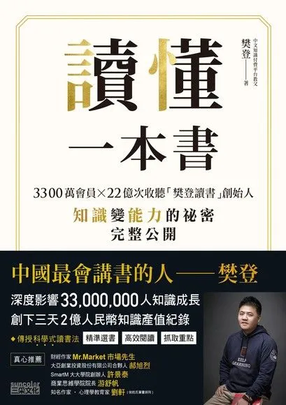

這是我近期讀過最推薦的一本書，甚至比《一流的人，都在哪裡畫線》還推薦，假如說《一流的人，都在哪裡畫線》是一個嚴厲的大叔，那《讀懂一本書》就是個循循善誘的長輩。

剛好這兩本書的概念都是在講如何閱讀一本書，裡面有一些觀點有重疊但是切入角度完全不一樣，看完《一流的人，都在哪裡畫線》，接著讀《讀懂一本書》會發現兩個作者的角度異常有趣。一流的人作者是日本仔，而讀懂一本書的作者是中國仔，這位日本作者就是非常一板一眼要求嚴格，而這位中國作者你可以看出來他也是拼了命努力的那種人，但是它對待讀者的語氣比較站在如何激發起你的讀書動機而不是直接大罵你應該怎樣怎樣。

書裡面我最喜歡的部分是 **如何「增加理解力的池子」**，以前看書沒想過這回事，就覺得有的書好看，有的書很硬讀不下去，原來是因為自己的理解力不夠，作者提供了七個方向和推薦可以增加基礎知識的[書單](https://mindscapes.wingster.cc/posts/how-to-read-a-book-by-fandan-reading-list/)，譬如第一個就是經濟學，以及為什麼會選經濟學以及可以從哪本書讀起。

其他重點摘要如下：

## 講書有什麼好處
假如我們只是單純閱讀書籍很容易讀完就忘，但是講書需要經過的過程除了眼睛 → 大腦之外，還要經過篩選 → 過濾 → 選擇 → 嘴巴講出來，所以講書是最高效沈浸式學習的一種方式。

## 講書的五種必備能力

**1. 邏輯思維能力**
要了解什麼叫前提、假設、論證，然後所有的論證又分為歸納法和演繹法。

**歸納法**就是你看到 N 個正確案例，於是判斷 N+1 個也是正確的，譬如太陽世世代代都從東邊升起，所以我們覺得太陽就是從東邊升起，這是歸納法。但是歸納法要很小心，因為他是有陷阱的，譬如《 隨機騙局》裡面有提到，我們看到很多書在講如何致富，譬如《 鄰家的百萬富翁》、《 有錢人想的跟你不一樣》，裡面把所有大富翁的特性全部整理起來，然後告訴你，只要你也這樣做你也可以變成百萬大富翁，但事實上所有真的照著做的人都變成百萬富翁了嗎？這從邏輯是站不住腳的，這時候要警惕。

再來是演繹法。

**演繹法**就是大前提、小前提和結論。只要大前提正確，小前提正確，結論一定是靠譜的。譬如：所有的人會死（大前提），蘇格拉底是人（小前提），所以蘇格拉底會死（結論），這就是演繹法。但演繹法也有一個 bug，這個 bug 就是「所有人都會死」其實是歸納法得出來的XD。雖然我們無法保證邏輯的完備，但是邏輯能力用在講書的話，就是看你能不能用大家都可以接受的邏輯來組織轉化你要表達的內容。

**2. 大局觀**
就是要了解整本書的架構，不是只注意到枝微末節。

**3. 語言能力**
最重要的其中一個是簡潔，你用一個小時說清楚一件事不難，難的是用三句話說清楚，因為你的簡潔是在為別人和自己節省認知成本。簡潔也代表你對這件事情充分理解了才可以輕鬆的描述出來。

**4. 同理心**
同理心是人和人溝通間非常重要的面相

**5. 幫助人的心**

當你的動機是出於，把內容講出來的當下可能可以幫助一個人生活做出改變，是非常有成就感的。只要有一個人聽了你講的書而改變了命運，你的講書就是有意義的。

## 買書秘訣
**1. 出版機構：** 在中國，一家好的出版機構會對自己的品牌負責任，所以在出書的時候會嚴選內容幫你把關。

**2. 作者背景：** 建議挑有學術背景的書，例如大學教授寫的書，他可能一輩子沒寫幾本暢銷書，但一輩子研究的精華都在這幾本書裡。比如《刻意練習》就是典型的教授寫的書。

**3. 推薦人：** 推薦人也要慎選，譬如比爾·蓋茲是個認真嚴肅的人，可以看他推薦的書。

**4. 好書中的推薦書單：** 書都是從書裡來的，譬如《湖濱散記》在很多本書裡都提到這本書，如果不是一本好書也不可能出現在別的好書當中。

**5. 書後的參考書目：** 有的時候從一本好書切入，就會產生指數型的推薦。「好書帶好書」是一個很有效的方法。

**6. 看內容**，這本書解決什麼問題：是真問題還是假問題？他有沒有提供解決方案？論證過程是否嚴謹？

**7. 翻譯和圖書印刷品質：** 翻譯、錯別字特別多，印刷品質都反映了出版人對一本書的重視程度，也間接決定了這本書的價值。

最後作者還有分享自己如何畫心智圖還有許多範例，可以觀察作者拆解一本書的思路脈絡，真是佛心來著，最後也附上我練習的心智圖當參考。

