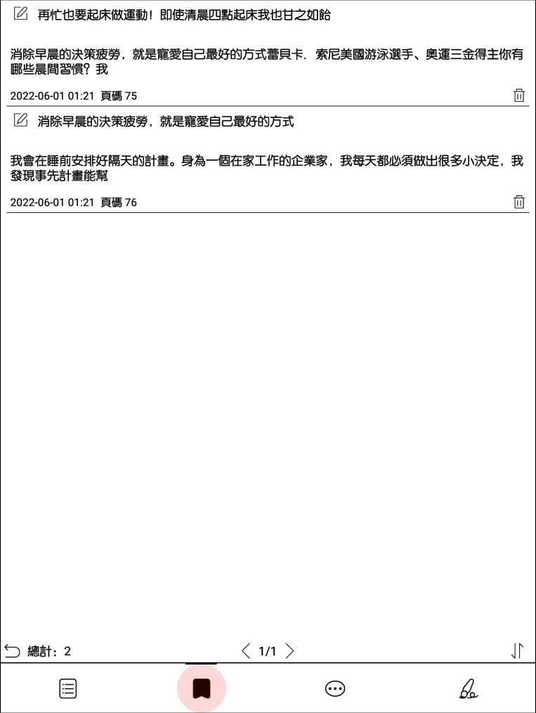
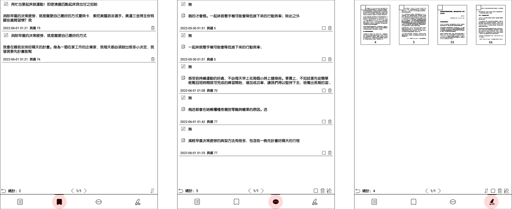

我自己在使用文石的時候，因為功能很多，很多功能又只顯示 Icon ， Icon 很多又不是很常見，於是常常會出現功能很多但是不知道怎麼用，最後就會每一個都點點看，真的需要使用某功能又浪費了很多時間尋找。

下面整理了我最常使用也最常忘記的功能之一：看書看到一半想記重點，但又忘記要去哪裡找，記下來之後有時候是圖片、有時候又是一整頁、有時候是文字，到底該怎麼整理？

閱讀電子書時，以下有三種筆記方式（以下以文石 Note 5為截圖範例）

## 1. Bookmark 書籤


- **使用情境：** 看到某個頁面，覺得整頁都是重點，想標記一整頁，之後再回頭來讀。

- **如何操作：** 可以點擊右上角書籤 icon 便會自動幫你儲存。

- **儲存書籤位置：** 點擊頁面正中間/左下角的目錄/下方第二個書籤 icon


`Step 1 點擊頁面正中間後，會出現左下角的目錄`


`Step 2 底下第二個書籤 icon`


## 2. Highlight 劃線


- **使用情境：** 看到一句話或是一段文字，想選取儲存起來

- **如何操作：** 長壓從頭到尾選取，會看到壓過的地方反白

- **儲存劃線位置：** 點擊頁面正中間/左下角的目錄/下方第三個劃線 icon

可輸出成 .txt 文字檔，存在本地或是寄到自己的 email

收到的 Email 裡面的 txt 檔 format 會長這樣

```
讀書筆記 | ⟪書名⟫ 作者 
日期時間 | 頁碼
劃線內容
```

```Email 裡面的 txt 檔```


假如要整理到 Notion 或其他筆記可以直接 Copy & Paste 還算是方便。

## 3. 手寫筆記


- **使用情境：** 喜歡用筆劃線或是作筆記，文石會自動把手寫的部分匯集在同一個頁面

- **儲存劃線位置：** 點擊頁面正中間/左下角的目錄/下方第四個筆的 icon

可輸出成 PNG 或 PDF，也會自動存在本地端。

`圖左至右，下方 icon 分別為書籤、劃線、手寫筆記`

