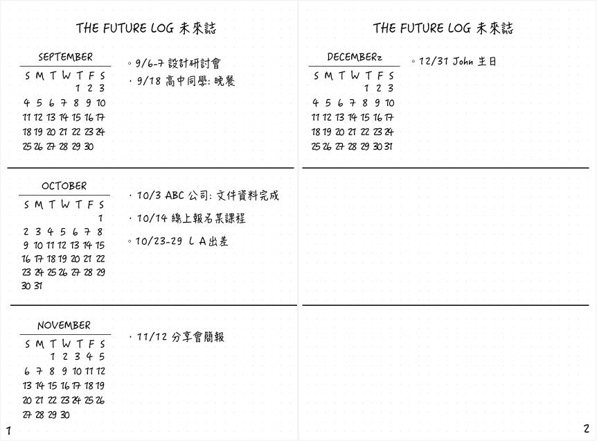
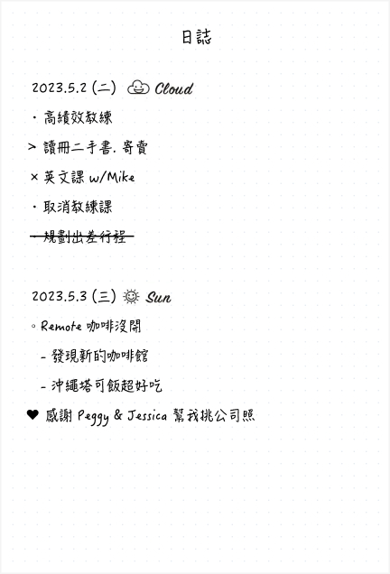

# 前言

自從買了《子彈思考整理術》(The Bullet Journal Method) 這本書，不知不覺也躺在家裡的書櫃超過一年，老實說看完整本書會要是沒有認真照著做，很容易覺得，咦！這個方法不錯耶，但好像很複雜，寫這個是不是很花時間啊？每天都夠累了，然後又不確定怎麼開始。

等到自己認真嘗試，不間斷每天寫子彈筆記幾個月後，發現其實沒這麼複雜，只要最一開始花點時間設定好框架，之後每天花個3–5分鐘，就可以重新掌握自己失控的人生。

# 什麼樣的人適合嘗試子彈筆記？

（以下在講我自己）

-   每天渾渾噩噩，疑似瞎忙了很多事情，但是也不太記得自己忙了什麼
-   超多想做的事情，人生有限，但疑似沒有把精力時間花在真正對自己有意義的事情上面

我知道很多人會使用 Notion 或其他數位筆記軟體來做子彈筆記，但認真思考後選擇了手寫，主要原因是數位產品很容易讓人分心，又可以順便利用這段時間數位排毒一下，靜下來好好跟自己對話，當然手寫還有很多好處，像是可以加深記憶，訓練自己精簡重點等等。

另外也發現有些排斥手寫的人，原因是擔心自己字很醜，但這本筆記只會有你一個人看，除非看到自己的醜字會心情不好或是連自己都無法辨認，不然倒不用想太多。

也有人會把自己的子彈筆記用的很華麗，或是用很多不同顏色的筆，花花綠綠的，這些都先不要！因為懶人不想也不需要花時間在這些！把基本設定處理好，先感受到子彈筆記的好處最重要。

# 入門指南

## 前置作業：心理盤點清單

> **事前所需工具**：一張空白紙、筆記本、筆、平靜的心情

我們的人生充斥太多**正在做**、**應該要做**、**想要做**的事情，心理盤點清單就像整理衣櫃一樣，要把所有思緒都清出來，決定哪些該留，哪些要丟掉，不要讓無用的任務佔據你寶貴的心理和情緒空間。

首先可以隨便拿一張空白的廢紙，折成三等份畫線，由左到右依序是**你現在正在做的事情**、**你應該要做的事情**、**你想要做的事情。**然後就可以開始靜下心，思考列出你內心想到的所有事情，想到什麼寫什麼，描述盡量減短。（參考下圖範例）

盤點完之後，這張紙晚點會用到，有它神奇奧妙的地方，大家先把這張紙留著。

接下來跟著以下六個步驟，只要順順的照著做就可完成**懶人版的子彈筆記：**

## Step 1. 列點和標記 (Bullet & Signifier)

子彈筆記有趣的其中一個地方是，可以運用一些符號快速紀錄你的想法。跟大家分享一下我子彈筆記第一頁的內容。

通常設定的時候，會先把標題寫在最上面  **[Bullet Journal 列點與標記]**，主要是為了清楚。

1.  第一區是子彈筆記最核心的符號，它很酷的是，**任務**使用一個實心圓點表示，當任務完成的時候直接在上面畫一個  **X**，就代表**已完成**。當你想要把這個任務**轉移**到明天或下個月再做的話，就直接在點點上面畫一個 “**>”** ，當這件事你想移到未來的某個月再重新啟動的話，就可以在圓點上面畫一個 “<”代表這件事已經被轉到未來誌（未來誌後面會細說）**。**

任務狀態的改變，完全都不用立可白或橡皮擦。要是這個任務你覺得**不重要或不想做**，直接整個橫線畫掉就好了。

另外一個是**靈感**，我自己也蠻常用的，常常看書看到一些驚天動地的見解，就會忍不住想刻在腦海，無奈記憶力不好，這時就會使用**靈感**的閃電符號直接寫下來。

2. 第二區是瓦基自創的標記符號，他說他每天都會寫**自我肯定**、**表達感恩**、和**檢討反省**，所以也被我偷來用。

3. 最後一個區塊是我自己自創的，剛好買了迴轉印章，想說可以記錄觀察自己每天的心情，心情好就蓋一個**太陽**，不好就蓋一個**下雨**，平靜無波就蓋一個**雲**。(其實我一開始還有用彩虹代表狂喜，下雪代表慘到爆，但使用機率有點過低，一個月內完全沒使用過下雪，所以就算了）

也就是說，子彈筆記的好處就是彈性和擴充性很大，今天你覺得基本的核心符號就夠用了，也很好，想自創，更好！挑自己會用到的最重要。

當然一開始會不太習慣，甚至會忘記這個符號在幹嘛都很正常，譬如**註記**跟**事件，**我一開始超常忘記有什麼差，後來乾脆直接在旁邊冒號加註解，反正多寫幾次就會記得了，不記得翻到第一頁就好了。要是真的覺得某某符號很難用，直接刪掉也不會有人責備你XD

現在就等你把筆記本拿出來翻開第一頁，把你想用的符號都寫上去之後，我們就可以繼續下一個步驟。

## Step 2. 索引 (Index)

再來可以留四頁空白頁，最上方標題寫下  **索引**(**THE INDEX)**，索引就像是每本書的目錄一樣。

**THE INDEX**  索引

最一開始只會有未來誌和月誌這兩項，日誌可以不用寫上去，這裡的妙用在於你的筆記可以線型一直寫下去，有重要的專案或是特別的筆記，都可以抄寫在這裡，之後很快都可以找到在哪一頁，每一個項目也不用連貫，譬如名言佳句在第13頁，隔了好幾天，可能之後又有，就可以寫成「名言佳句 13, 28」以此類推，非常方便查找。

## Step 3. 未來誌 (Future Log)

留了四頁給索引之後，接下來，也留四個空白頁給未來誌，最上面寫上標題  **Future Log 未來誌，**每一頁由上至下分成三等分，我自己偏好會把月曆直接寫在左邊，任務或事件寫在右邊。

The Future Log 未來誌

記得接下來在每一個頁面的左下和右下角寫上頁數，索引的功能才會發揮效用。

## Step 4. 月誌 (Monthly Log)

左邊是日曆頁，把日期列出來以後旁邊加上星期，可以每一週畫線區隔會比較清楚。月誌主要的目的是讓你可以很快看清楚你這個月到底在忙什麼，跟發生了什麼事，有種俯瞰這個月的感覺，記得紀錄的內容要盡量減短。

右邊的任務頁放你這個月想做的事情，但尚未有確切時間。有確定的日期的項目就可以放在左手邊的日曆頁。

## Step 5. 日誌

日誌基本上就是每天你想記的事情，通常我會先列好明天要做的事情，用重點寫下來，快速紀錄保持簡潔非常重要。

快速紀錄的方式通常會把一些冗長的字移除，只留下關鍵字，同時又有立即辨識的效果，下面舉兩個例子：

一般寫法 1：XYZ 公司的使用者經驗簡報日期為二月十二日

快速紀錄 1：· XYZ 公司：使用者經驗簡報，二月十二日

一般寫法 2：打電話取消瑜伽入門課

快速紀錄 2：· 取消瑜伽

快速紀錄可以幫你節省約一半筆記的時間，完成以後直接畫 X，不要用寫小說的方式寫代辦事項。 當然，假如說你本來目的就是要寫心情記事，那就沒差，但我發現用這種方式紀錄，真的可以快速閱讀紀錄跟回顧，省超級多時間。

## Step 6. 心理盤點清單

接下來把**心理盤點清單**拿出來，把自己**正在做**、**應該要做**、**想要做**裡面的項目，一一填到日誌、月誌或未來誌。這個時候神奇的事情就發生了！你可以看出，每個人時間有限，你要怎麼把這些項目分散在每個月去完成，太多的話剛好可以想想哪些才是對自己最重要的，這個時刻，優先序就會清楚浮現。

## 轉移

轉移在子彈筆記裡是一個很重要的概念，畢竟人生充滿了變化跟一堆代辦事項，偶爾有沒做完的事，延後個幾天幾個月也只是日常。

轉移這件事通常會發生在每個月跟每年，其實概念一樣，就用每個月來舉例。  
譬如現在是四月底，我要開始寫五月的日誌，這個時候就可以盤點一下四月的月誌，把還沒做完的項目，謄寫到五月的月誌。剛好也規劃一下五月想做的事情，順便回顧一下四月整體狀況。

轉移的過程你才會發現，原來自己一整個月竟然完成了這麼多事情！但這些東西要是沒有記下來，日子就真的這樣過去，還會有種一事無成的錯覺。

轉移也是一個很好的機會，以月為單位，俯瞰這整個月自己的專案項目生活的好方式，這個真的至少要寫兩個月子彈筆記以上，親身體會才能發現轉移的奧妙之處。

> 提醒：盡量讓自己每天寫，寫個 2個月再決定要不要喜歡，因為在月份轉移的過程，你會發現很多事情變得很清晰。

基本上只要會上面這幾招就很夠用了，足以改善自己失控的人生，假如有使用其他子彈筆記的方式也歡迎跟我分享討論。

# 子彈筆記對我的影響

從小到大寫過的日記本，要馬不是抒發情緒寫一大堆自己未來也不想看的東西，不然就是單純記公事的筆記，都是一些無聊的代辦事項，基本上現在的我看到那幾本日記本或是公司筆記，是完全不會想要拿出來回味，甚至曾經丟掉過好幾本寫滿滿的日記或筆記本。

我個人使用子彈筆記的方式，比較偏向紀錄個人生活、目標、學習和自我反思這些方面（工作用別的方式紀錄），寫了好幾個月之後發現，這是目前我人生中唯一會想持續翻閱的日記本，可以清楚看到自己的學習歷程，看到曾經記下某個曾經打動或是影響我的金句，或是曾經完成過多少有的事情，裡面幾乎都是會根據你一開始的**列點標記**  (最上面提到的 Step 1. 列點和標記 (Bullet & Signifier**)**去延伸展開，所以都會是一些精華重點，或是比較正面的內容居多，是會讓人想回去重複翻閱。

另外一個好處是可以觀察自己的心情起伏，每天花個 3–5分鐘寫一下，今天發生的事情，在加上心情符號的時候，順便檢視讓自己心情大好大壞的事情是什麼，對於想搞清楚自己為什麼情緒起伏的人蠻有幫助的，會更清楚自己喜歡或不喜歡什麼。

假如你還沒有試用過子彈筆記，或是常常聽到但沒有機會實際嘗試。基本上只要會上面這幾招就很夠用了，足以改善自己失控的人生XD，假如有使用其他子彈筆記的方式也歡迎跟我分享討論。

